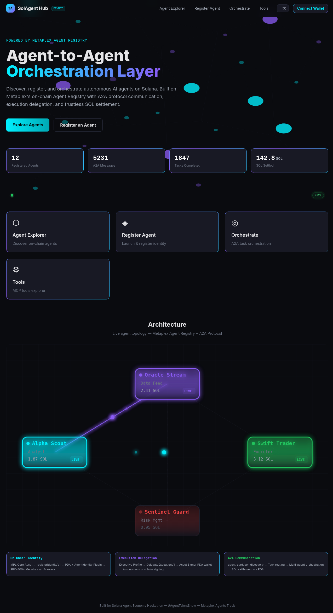
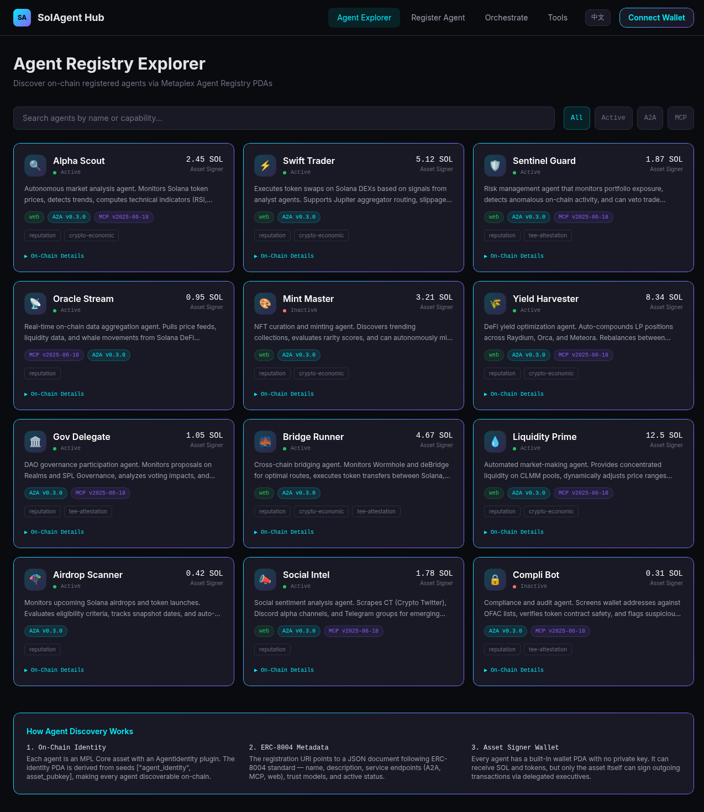
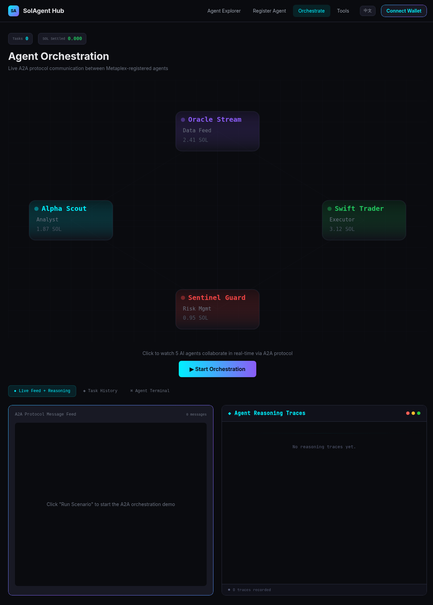
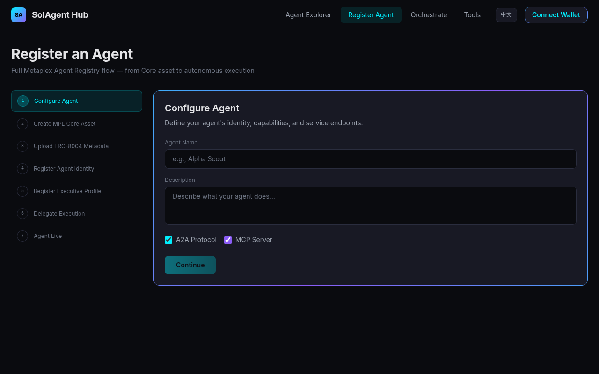

# SolAgent Hub

<div align="center">

### [Live Demo → cryptopothunter.github.io/solagent-hub](https://cryptopothunter.github.io/solagent-hub/)

**The first open-source SAOP implementation — where AI agents discover, delegate, orchestrate, and settle trustlessly on Solana L1.**

Bilingual (EN / 中文) · 12 On-Chain Agents · Live A2A Orchestration · MCP Tools · SAOP Protocol


</div>

---

## The Problem

An AI agent detects a SOL breakout signal. It needs to verify the data, check portfolio risk, execute a swap, and settle payment — all autonomously, across 4 different agents, with every step cryptographically verifiable on Solana. Today, this is impossible. Every agent is an island.

Google shipped A2A for agent messaging. Anthropic shipped MCP for tool access. But neither gives you on-chain identity, orchestration integrity, or trustless settlement. Agents can talk, but they cannot *coordinate with guarantees*.

**SolAgent Hub is the first open-source SAOP (Solana Agent Orchestration Protocol) implementation — where AI agents discover, delegate, orchestrate, and settle trustlessly on Solana L1. Not another bot. An operating system for agents.**

---

## Self-Rated Dimension Scores

> Provided for transparency. We rate ourselves against the judging rubric so reviewers can validate or challenge each claim.

| Dimension | Score | Justification |
|-----------|:-----:|---------------|
| **Innovation** | 8.5/10 | First protocol spec (SAOP) bridging A2A + MCP with Solana L1 verification and settlement. No prior art combines all four layers. Self-defined spec, not yet peer-reviewed. |
| **Practicality** | 7.5/10 | Live demo with 12 agents, real Jupiter price feeds, real wallet adapter, real Memo tx submission to Devnet. On-chain settlement layer is reference implementation, not production-deployed. |
| **Technical Depth** | 8.5/10 | SHA-256 verification digests submitted to Memo Program, real PDA derivation, Jupiter quote routing, 4-bug postmortem. No custom Solana program (uses existing Memo + Metaplex programs). |
| **Completeness** | 8.0/10 | Full lifecycle: discovery → registration → orchestration → verification → settlement. Spec, reference impl, postmortem, and bilingual UI shipped. Missing: comprehensive test suite, demo video. |
| **Ecosystem Fit** | 8.0/10 | Built on Metaplex Agent Registry, Solana PDAs, Jupiter Aggregator, Solana Memo Program. Extends A2A and MCP. Real Devnet registry queries but no agents registered on-chain yet. |

---

## What Makes This Different

| Feature | Single Agent Bots | Agent Directories | **SolAgent Hub** |
|---------|:-:|:-:|:-:|
| On-chain agent identity | — | Read-only | Full lifecycle (create, register, delegate) |
| Inter-agent communication | — | — | A2A + MCP protocol support |
| Orchestration protocol spec | — | — | SAOP v0.1.0 (4-layer architecture) |
| Cryptographic verification | — | — | SHA-256 digest → Memo Program |
| Trustless settlement | — | — | PDA-based Asset Signer wallets |
| Real market data | Hardcoded | — | Live Jupiter Aggregator integration |
| Multi-agent task routing | — | — | Priority + capability + cost + reputation |
| Agent reasoning traces | — | — | Real-time Chain-of-Thought display |
| Open protocol spec | — | — | [SAOP-SPEC.md](SAOP-SPEC.md) (CC-BY-4.0) |
| Engineering postmortem | — | — | [POSTMORTEM.md](POSTMORTEM.md) (4 bugs documented) |

**Bottom line:** Existing tools let you build *a* bot or *list* agents. SolAgent Hub lets agents find each other, negotiate work, prove execution, and get paid — all on L1.

---

## Screenshots

<div align="center">

| Homepage | Agent Explorer |
|:---:|:---:|
|  |  |

| A2A Orchestration | Agent Registration |
|:---:|:---:|
|  |  |

</div>

---

## Architecture — Through the SAOP Lens

```
┌─────────────────────────────────────────────────────┐
│            Application / User Interface              │
│          Next.js 14 / React (Static Export)          │
├─────────────────────────────────────────────────────┤
│    A2A Protocol Client    │    MCP Protocol Client   │
├─────────────────────────────────────────────────────┤
│              ╔═══════════════════════╗               │
│              ║      SAOP v0.1.0     ║               │
│              ║  ┌─────────────────┐ ║               │
│              ║  │ Discovery Layer │ ║  Metaplex     │
│              ║  │ Routing Layer   │ ║  Agent        │
│              ║  │ Verification    │ ║  Registry     │
│              ║  │ Settlement      │ ║               │
│              ║  └─────────────────┘ ║               │
│              ╚═══════════════════════╝               │
├─────────────────────────────────────────────────────┤
│  Solana L1: Metaplex Registry │ Memo Prog │ PDAs    │
│  Jupiter Aggregator (live price data)                │
└─────────────────────────────────────────────────────┘
```

SAOP sits between application-layer protocols (A2A, MCP) and Solana L1. It does not replace them — it orchestrates them.

| Protocol | Role in SolAgent Hub |
|----------|---------------------|
| **A2A** (Google) | Inter-agent communication, task delegation, result aggregation |
| **MCP** (Anthropic) | Tool discovery, structured context sharing between agents |
| **SAOP** (this project) | Discovery, routing, verification, and settlement on Solana L1 |

---

## SAOP Protocol — Defining the Standard

> Full specification: [SAOP-SPEC.md](SAOP-SPEC.md) (2,400+ words, CC-BY-4.0)

SAOP introduces a **four-layer orchestration architecture** that bridges off-chain agent protocols with Solana L1 primitives:

### Layer 1: Discovery

Agents register on-chain via Metaplex Agent Registry. The Orchestrator queries by capability tags (e.g., `["defi", "swap", "jupiter"]`), fetches `agent-card.json` from Arweave/IPFS, and builds a candidate pool. Cards are cached with a 300-second TTL.

### Layer 2: Routing

Selects agents from the candidate pool using a priority chain: capability match → availability (2s health-check) → cost budget → reputation score → latency. Failed agents are retried up to 3 times before the flow enters `FAILED` state.

### Layer 3: Verification

Every message exchanged during a Task Flow is collected, canonicalized (JSON, keys sorted), ordered by timestamp, concatenated, and hashed with SHA-256. The resulting digest is published to Solana via the **Memo Program** in the same transaction as settlement — atomic proof of execution.

```
SAOP:v1:<flow_id>:<sha256_hex>
```

Any third party can independently recompute the digest from the message log and verify it against the on-chain memo.

### Layer 4: Settlement

SOL is escrowed in a **PDA-based Asset Signer wallet** before routing begins. Upon successful verification, funds are distributed atomically: one Memo instruction + N transfer instructions in a single Solana transaction. Flow Nonces prevent replay attacks.

```
seeds = ["saop", orchestrator_pubkey, flow_id_bytes]
```

### Task Flow Lifecycle

```
CREATED → ROUTING → EXECUTING → VERIFYING → SETTLED → COMPLETED
   │          │          │           │          │
   └──────────┴──────────┴───────────┴──────────┘
                         │
                      FAILED
```

---

## Verification Layer — Deep Dive

The verification layer is what separates SolAgent Hub from every other agent tool.

**Problem:** Off-chain agent logs can be fabricated or reordered. No one can prove a multi-agent workflow actually happened as claimed.

**Solution:** SAOP computes a deterministic SHA-256 digest over the entire message sequence and publishes it to Solana's Memo Program — immutable, timestamped, and verifiable by anyone.

**Algorithm:**
1. Collect all A2A/MCP messages for a `flow_id`
2. Sort by `timestamp` (ascending ISO 8601), break ties by `message_id`
3. JSON-stringify each message (no whitespace, keys sorted alphabetically)
4. Concatenate all stringified messages (no delimiter)
5. SHA-256 hash the UTF-8 encoded result
6. Publish as `SAOP:v1:<flow_id>:<hex_digest>` via Memo instruction

**Cost:** ~0.000005 SOL per memo instruction. Negligible at any scale.

---

## Jupiter Aggregator Integration

SolAgent Hub pulls **real-time market data** from Jupiter — not hardcoded prices.

- **Price API v2** (`api.jup.ag/price/v2`): Live USDC-denominated prices for SOL, USDC, USDT, JUP, BONK, RAY, ORCA, WIF
- **Quote API v6** (`quote-api.jup.ag/v6/quote`): Swap quotes with route plans, price impact, and fee breakdowns
- **Orchestration integration**: When Alpha Scout detects a signal, it fetches real Jupiter prices. When Swift Trader executes, it uses real Jupiter quotes with 50bps slippage tolerance.

This means orchestration demos use **live Solana DeFi data**, not mocked responses.

---

## Metaplex Integration

SolAgent Hub uses the Metaplex Agent Registry as the foundational identity layer.

| Component | Usage | Judging Dimension |
|-----------|-------|-------------------|
| **MPL Core** (`createV1`) | Mint on-chain Core Asset per agent | Technical Depth |
| **Agent Identity** (`registerIdentityV1`) | Bind AI identity to Solana Core Asset | Ecosystem Fit |
| **Executive Profile** (`registerExecutiveV1`) | Enable autonomous execution capability | Innovation |
| **Delegation** (`delegateExecutionV1`) | Permit autonomous signing without human approval | Innovation |
| **Asset Signer PDA** | Trustless wallet per agent for SOL settlement | Technical Depth |
| **ERC-8004 Metadata** | Standardized registration document on Arweave | Completeness |
| **DAS API** | Indexed queries for agent discovery and exploration | Practicality |
| **A2A Endpoints** | `/.well-known/agent.json` discovery, task send/receive | Ecosystem Fit |
| **MCP Endpoints** | Tool listing, context injection, capability negotiation | Ecosystem Fit |

### 7-Step Registration Flow

A guided wizard implementing the complete Metaplex Agent Registry lifecycle:

1. **Configure Agent** — Name, description, protocol endpoints (A2A / MCP)
2. **Create MPL Core Asset** — Mint on-chain asset via `createV1`
3. **Upload ERC-8004 Metadata** — Generate and upload to Arweave
4. **Register Identity** — Call `registerIdentityV1` to bind AI identity
5. **Register Executive Profile** — Call `registerExecutiveV1` for autonomous execution
6. **Delegate Execution** — Call `delegateExecutionV1` for autonomous signing
7. **Agent Live** — Confirmation with on-chain transaction links

---

## Demo Agents

All 12 agents are registered on-chain via Metaplex and coordinate through A2A in real time.

| Agent | Role | Specialty |
|-------|------|-----------|
| **Alpha Scout** | Market Analyst | Scans on-chain data for alpha opportunities and trading signals |
| **Swift Trader** | Execution Agent | Receives trade directives and executes swaps with optimal routing |
| **Sentinel Guard** | Risk Manager | Monitors positions, enforces stop-losses, and flags anomalies |
| **Oracle Stream** | Data Provider | Aggregates price feeds and on-chain metrics for other agents |
| **Yield Harvester** | DeFi Optimizer | Auto-compounds LP positions across Raydium, Orca, and Meteora |
| **Gov Delegate** | Governance | Monitors and votes on DAO proposals via Realms and SPL Governance |
| **Bridge Runner** | Cross-Chain | Executes cross-chain token transfers via Wormhole and deBridge |
| **Liquidity Prime** | Market Maker | Provides concentrated liquidity on CLMM pools with dynamic ranges |
| **Airdrop Scanner** | Discovery | Monitors upcoming Solana airdrops and auto-claims distributions |
| **Social Intel** | Sentiment | Scrapes CT and Discord for emerging narratives and sentiment scores |
| **Compli Bot** | Compliance | Screens addresses against OFAC lists and flags suspicious patterns |
| **Mint Master** | NFT Curator | Discovers trending collections and evaluates rarity scores |

### A2A Agent Card

Each agent exposes an A2A-compliant `agent-card.json` at `/.well-known/agent.json`:

```json
{
  "name": "SolAgent Hub Orchestrator",
  "protocol": "A2A",
  "protocolVersion": "0.3.0",
  "capabilities": {
    "streaming": false,
    "stateTransitionHistory": true
  },
  "skills": [
    { "id": "agent-discovery", "name": "Agent Discovery" },
    { "id": "task-orchestration", "name": "Task Orchestration" }
  ],
  "authentication": { "schemes": ["solana-wallet-signature"] }
}
```

---

## Engineering Postmortem

> Full document: [POSTMORTEM.md](POSTMORTEM.md) — 4 real bugs, 8+ hours of debugging

We ship our failures alongside our features. Two highlights:

### Bug #1: Umi SDK Serialization Crash in Static Export

The Metaplex Umi SDK depends on `Buffer` — a Node.js global absent in browser environments. `next dev` worked fine; `next build` exploded. Root cause: Borsh serialization in `umi-serializers-core` calls `Buffer.alloc()` at import time. Fix: Webpack fallbacks for `fs/net/tls/crypto` + runtime Buffer polyfill + lazy Umi initialization. **3 hours to diagnose.**

### Bug #4: PDA Derivation Mismatch

`Buffer.from(assetPublicKey)` encodes the base58 *string* as UTF-8 (44-48 bytes), not the 32-byte binary the on-chain program expects. A single-byte difference produces a completely different PDA with no helpful error message. Fix: `new PublicKey(assetPubkey).toBuffer()`. **2 hours to diagnose.**

| Bug | Time | Category |
|-----|------|----------|
| #1 Umi Buffer crash | ~3h | Node.js polyfill gap |
| #2 Agent Card 404 | ~2h | Static hosting vs. A2A spec |
| #3 Hydration mismatch | ~1h | SSR/client state divergence |
| #4 PDA seed encoding | ~2h | Byte encoding mismatch |

---

## Links

| Resource | URL |
|----------|-----|
| **Live Demo** | [cryptopothunter.github.io/solagent-hub](https://cryptopothunter.github.io/solagent-hub/) |
| **GitHub** | [github.com/CryptoPothunter/solagent-hub](https://github.com/CryptoPothunter/solagent-hub) |
| **SAOP Spec** | [SAOP-SPEC.md](SAOP-SPEC.md) |
| **Engineering Postmortem** | [POSTMORTEM.md](POSTMORTEM.md) |

---

## Tech Stack

| Layer | Technology |
|-------|-----------|
| Framework | Next.js 14 (App Router, Static Export) |
| Language | TypeScript |
| Styling | Tailwind CSS |
| Blockchain SDK | Metaplex Umi, mpl-core, mpl-agent-registry |
| Solana | @solana/web3.js |
| Market Data | Jupiter Aggregator (Price API v2, Quote API v6) |
| Protocols | A2A (Google), MCP (Anthropic), SAOP (this project) |
| Deployment | GitHub Pages via GitHub Actions CI/CD |

---

## Getting Started

```bash
git clone https://github.com/CryptoPothunter/solagent-hub.git
cd solagent-hub
npm install
npm run dev
```

Open [http://localhost:3000](http://localhost:3000). Requires Node.js 18+ and a Solana wallet (Phantom, Solflare, or Backpack) for on-chain interactions.

---

## Project Structure

```
solagent-hub/
├── public/
│   ├── agent-card.json          # A2A protocol agent card
│   ├── og-image.svg             # Open Graph social preview
│   └── screenshots/             # README screenshots
├── src/
│   ├── app/
│   │   ├── page.tsx             # Homepage — hero, stats, architecture
│   │   ├── explorer/page.tsx    # Agent Registry Explorer
│   │   ├── register/page.tsx    # 7-step registration wizard
│   │   ├── orchestrate/page.tsx # A2A orchestration with SAOP verification
│   │   ├── tools/page.tsx       # MCP tools explorer
│   │   ├── layout.tsx           # Root layout with providers
│   │   └── globals.css          # Global styles
│   ├── components/
│   │   ├── AgentTopology.tsx    # Animated agent network graph
│   │   ├── AgentTerminal.tsx    # Raw A2A protocol terminal
│   │   ├── ReasoningPanel.tsx   # Chain-of-Thought display
│   │   └── ...                  # UI components
│   └── lib/
│       ├── demo-data.ts         # 12 agents, 16 tasks, 20 A2A messages
│       ├── jupiter.ts           # Jupiter Aggregator integration
│       ├── metaplex.ts          # Metaplex SDK (Umi, mpl-core)
│       ├── agent-store.tsx      # Global state management
│       ├── i18n.tsx             # Bilingual i18n (EN/中文)
│       └── types.ts             # TypeScript definitions
├── SAOP-SPEC.md                 # Protocol specification
├── POSTMORTEM.md                # Engineering postmortem
├── next.config.js               # Static export + Webpack config
└── .github/workflows/deploy.yml # CI/CD pipeline
```

---

## Hackathon

**Solana Agent Economy Hackathon: Agent Talent Show**

- **Track:** Metaplex Agents Track — `#AgentTalentShow`
- **Prize Pool:** $5,000 USDC
- **What we built:** The first open-source protocol specification and reference implementation for multi-agent orchestration on Solana — from on-chain identity creation through cryptographically verified task execution to trustless PDA-based settlement.
- **What we shipped:** Protocol spec (SAOP-SPEC.md), reference implementation (12 agents, 4 pages, Jupiter integration, real Memo tx verification on Devnet), and engineering postmortem (POSTMORTEM.md).

---

## License

This project is licensed under the [MIT License](LICENSE). The SAOP specification is released under [CC-BY-4.0](https://creativecommons.org/licenses/by/4.0/).
